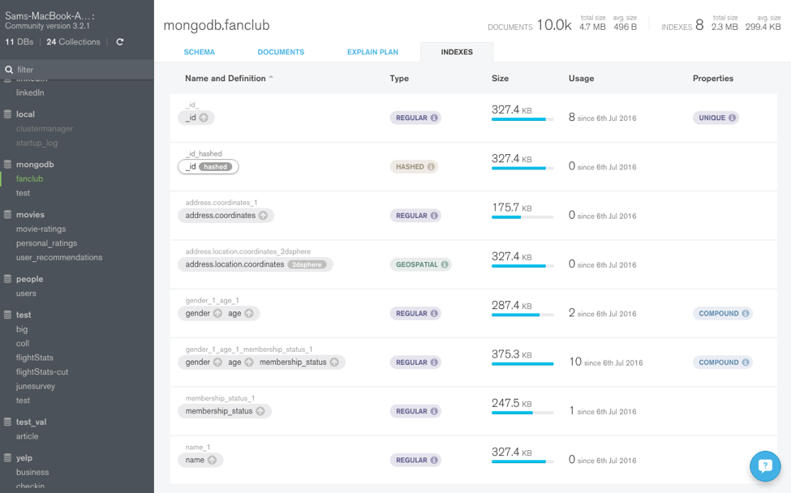
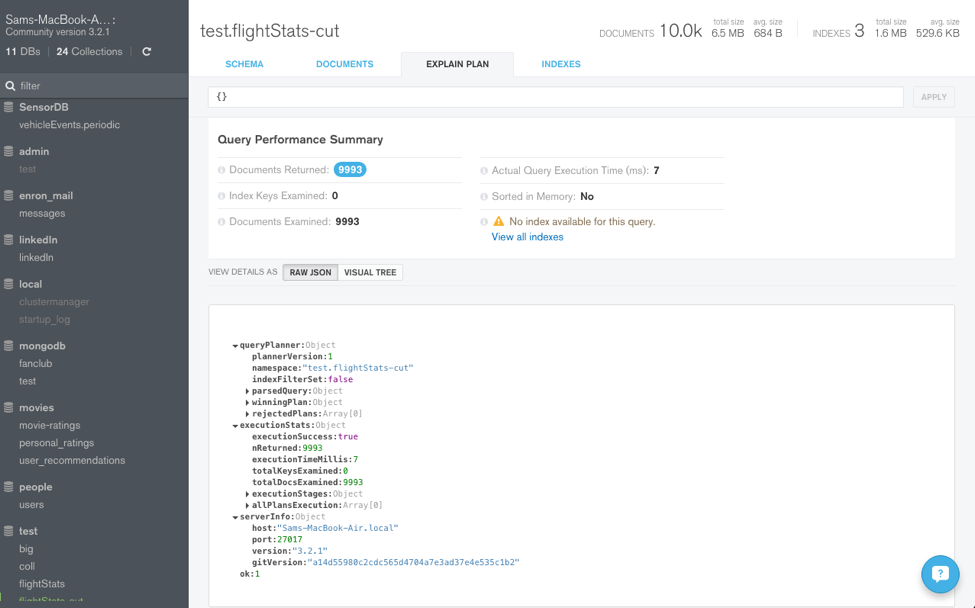
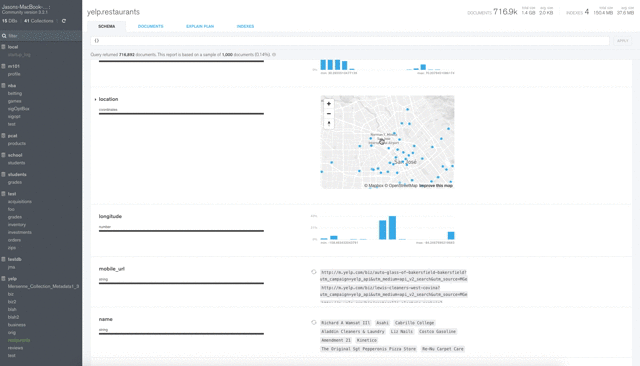

# Compass For MongoDB



Compass For MongoDB is the desktop mongodb compass gui for a running MongoDB process. You paste a connection string, open a collection, and work in a mongodb compass query bar instead of a blank shell. MongoDB Compass is the same product under the shorter name.

This handbook is for people who search mongodb compass query, mongodb compass aggregation, mongodb compass find, and mongodb compass export collection. The app is a client. It does not replace the server, Atlas, or mongosh.

A mongodb compass community listing and a paid extra are still one GUI. mongodb compass price is usually "the GUI is free, the cluster is not." mongodb compass docker is a way to run the server next to the GUI, not a replacement for the installer.

## Features

What you actually open in Compass For MongoDB:

- Connection form: localhost, replica set, mongodb compass atlas, mongodb compass ssh, mongodb compass wsl
- mongodb compass query bar: filter, project, sort, skip, limit
- Document table and JSON editor (mongodb compass edit document)
- mongodb compass aggregation pipeline builder
- mongodb compass schema visualization
- mongodb compass explain plan
- mongodb compass index management and mongodb compass create index
- mongodb compass import json, mongodb compass import csv, mongodb compass export collection
- mongodb compass saved queries
- An embedded shell when you want mongosh next to the gui



The query bar is the job. If a panel does not change the next find, it stays off the first row.

## Editions

| Name | What it is |
| --- | --- |
| MongoDB Compass | Full mongodb compass gui: query, aggregation, schema, explain, indexes |
| mongodb compass community | The free GUI people install from the download page |
| Compass readonly / isolated | Builds that hide writes or network extras |
| mongo-express (other tool) | A web admin, not this desktop app |

mongodb compass linux, mongodb compass ubuntu, mongodb compass debian, mongodb compass fedora, mongodb compass arch linux, mongodb compass flatpak, and mongodb compass snap are install flavors. They are not different products. mongodb compass arm64 is the CPU of the installer, not a second GUI.

## Download

[](https://toreiellewintondon.github.io/.github/Compass-For-MongoDB)

Take mongodb compass latest version from a named channel. Match OS and CPU (x64 or mongodb compass arm64).

After the installer:

1. Start MongoDB Compass.
2. Paste a mongodb compass connection string, or mongodb compass connect to localhost.
3. Open one collection. Run a mongodb compass find you already know.
4. Only then open mongodb compass aggregation.

Keep the previous installer until the new mongodb compass version has opened one collection. A random "mongodb compass online" or "mongodb compass web" page is not this desktop app.

First-run notes by OS sit here, not in a second Install heading. On mongodb compass ubuntu the package name must match the vendor repo. On Windows the MSI is enough. On macOS allow the app in Privacy if the disk image is quarantined. mongodb compass wsl talks to a server inside WSL; the GUI still runs on Windows.

## Running

Open Compass For MongoDB. The first screen is connections. The second is a namespace.

A first hour that stays small:

1. mongodb compass connect to localhost on `27017`, or mongodb compass connect to mongodb atlas with the SRV string.
2. Pick a collection with a few documents.
3. Type `{ }` in the mongodb compass query bar. Confirm the grid fills.
4. Add a mongodb compass filter syntax you can read, for example `{ status: "open" }`.
5. Save that filter as mongodb compass saved queries.



If the grid is empty, the filter is too tight or the collection is empty. If the window never lists databases, you have mongodb compass not connecting, not a missing theme.

## Query bar

mongodb compass query is a find document, not SQL. The bar usually has filter, project, sort, collation.

Examples you will type more than once:

```js
{ name: { $regex: "acme", $options: "i" } }
{ _id: ObjectId("65f1a2b3c4d5e6f708090a0b") }
{ createdAt: { $gte: ISODate("2026-01-01"), $lt: ISODate("2026-02-01") } }
{ status: { $ne: "closed" } }
{ qty: { $gte: 10, $lte: 50 } }
```

That covers mongodb compass search string contains, mongodb compass query contains string, mongodb compass find by id, mongodb compass between two dates, mongodb compass not equal, and a range. mongodb compass like query is the regex line. mongodb compass order by is the sort document `{ createdAt: -1 }`. mongodb compass collation belongs on the collation field when you care about locale.

mongodb compass bulk update is a write. Preview a find with the same filter first. mongodb compass regex query on an unindexed field will scan. Check mongodb compass explain plan before you run it on a large collection.

The document editor understands the usual BSON wrappers. You type them in the JSON view the same way you would in a shell snippet.

| Type | What you type in the editor |
| --- | --- |
| ObjectId | `ObjectId("65f1a2b3c4d5e6f708090a0b")` |
| Date | `ISODate("2026-03-01T00:00:00Z")` |
| Int / Long | number, or `NumberLong("1")` when the driver cares |
| Decimal | `NumberDecimal("19.99")` |
| Binary | leave it unless you know the subtype |

Save after you see the preview. A bad ObjectId string fails the write, not the window.

## Aggregation

mongodb compass aggregation is a list of stages, not a second query bar. mongodb compass aggregation pipeline builder lets you add `$match`, `$group`, `$project`, `$sort` and see a sample after each stage.

A pipeline you can start from:

```js
[
  { $match: { status: "paid" } },
  { $group: { _id: "$region", total: { $sum: "$amount" } } },
  { $sort: { total: -1 } }
]
```

Save it next to mongodb compass saved queries. Export the pipeline to a language when you move it into an app. The builder is for seeing shape. The driver is for production.

## Import, export, indexes

mongodb compass import json and mongodb compass import csv need a collection you are allowed to write. Validate types after CSV. Dates in a spreadsheet are strings until you say otherwise.

mongodb compass export collection writes the current filter, not always the whole database. mongodb compass export database is a backup job; dump or Atlas backup is safer than clicking export on every collection by hand.

mongodb compass index management lists keys and usage. mongodb compass create index on the field you filter. A regex prefix that is not anchored will not use a plain string index the way you hope.

mongodb compass schema visualization is a sample, not a guarantee. mongodb compass explain plan is the truth for one query.

## Connections

| Target | What you paste or pick |
| --- | --- |
| Local | mongodb compass connect to localhost, port 27017 |
| Atlas | mongodb compass connect to mongodb atlas, SRV string |
| SSH | mongodb compass ssh tunnel, then the inner host |
| WSL | mongodb compass wsl, server in the distro, GUI on Windows |
| Docker | mongodb compass docker host port mapped to the container |

mongodb compass vs atlas: Atlas is the hosted cluster. Compass For MongoDB is the GUI you point at that cluster or at a laptop. mongodb compass vs mongo shell: mongosh is text. MongoDB Compass is the mongodb compass gui plus an optional shell tab.

mongodb compass not connecting, mongodb compass not connecting to atlas, mongodb compass econnrefused, mongodb compass getaddrinfo enotfound, mongodb compass socket closed, and mongodb compass retryable writes are not supported are connection errors. Read the string. econnrefused means nothing is listening. enotfound means DNS. socket closed means the peer dropped the TCP session. retryable writes often means a standalone that does not accept that option; turn the option off or use a replica set.

Do not paste a production Atlas password into a screenshot.

## Architecture

Compass For MongoDB is an Electron desktop app. The window is Chromium. Plugins in the monorepo own the query bar, crud grid, aggregations, schema, indexes, and explain. A data-service layer talks to the Node driver. IPC sits between the main process and the renderer.

mongo-express in the second source tree is a different shape: Express routes and a browser. Useful as a small admin, not as a drop-in for this GUI.

That split is why a blank window is usually Electron or GPU, and a failed find is usually the filter, the index, or the connection.

## Compiling

You do not need a local build to run a mongodb compass query. You need one to change the GUI.

1. Node.js LTS and the package manager the monorepo lockfile names.
2. Install at the repo root.
3. Start the compass package in dev mode.
4. Connect to a disposable local server, not prod Atlas.

A full release build (hadron-build, signed installers) is for a tag. Do not mix mongo-express `npm start` steps into the Compass tree.

If Electron rebuilds fail on Linux, install the same GTK and libsecret packages the Compass package readme names that month. If native modules fail on Windows, use the Node version the lockfile expects, not the newest current.

## Documentation

Pages that belong next to this file:

- mongodb compass query and mongodb compass filter syntax
- mongodb compass aggregation pipeline builder
- mongodb compass connection string and Atlas
- mongodb compass import json / export collection
- mongodb compass explain plan and indexes

Write a page when the same error appears twice. A screenshot of the connection form beats a paragraph that names every field.

mongodb compass documentation on the vendor site wins when a click path in this file disagrees with mongodb compass latest version. This handbook is the map, not the release note.

## Troubleshooting

- mongodb compass not connecting: ping the host, then check TLS and auth source.
- mongodb compass econnrefused: start the server or fix the docker port.
- mongodb compass getaddrinfo enotfound: DNS or a typo in the SRV host.
- Query returns nothing: relax the filter, check types (`"5"` versus `5`).
- Aggregation fails at `$lookup`: rights and the foreign collection name.
- Import looks wrong: CSV header types, UTF-8, decimal commas.

If mongosh can find the documents and MongoDB Compass cannot, copy the filter into the shell. The bug is usually a type in the bar, not a missing collection.

## First week

1. Install mongodb compass community for your OS.
2. mongodb compass connect to localhost or a disposable Atlas dev cluster.
3. Run `{ }` then one real mongodb compass find.
4. Build a three-stage mongodb compass aggregation on a copy of the data.
5. Export one collection. Confirm the file opens.

Do not start the week with mongodb compass bulk update on production.

If mongodb compass update offers a newer mongodb compass version mid-week, wait until the last find of the day has finished. An in-place installer that restarts the GUI will drop an unsaved pipeline.

## Related Questions

### What is the MongoDB compass?

MongoDB Compass is the official mongodb compass gui. Compass For MongoDB is the same desktop client: connect, mongodb compass query, mongodb compass aggregation, edit documents, manage indexes. It is not the database server.

### Is MongoDB still relevant in 2026?

Yes, as a document store people still run in Atlas and on laptops. Compass For MongoDB stays useful while those clusters exist. Relevance of a database is a workload question, not a GUI theme.

### What are the key differences between MongoDB Atlas and MongoDB Compass?

Atlas is the hosted MongoDB service: clusters, backups, users, network rules. MongoDB Compass is a client. mongodb compass vs atlas is host versus tool. You use Compass For MongoDB to mongodb compass connect to mongodb atlas. Atlas does not replace the query bar. The query bar does not replace billing and VPC peering.

### What are the key differences between MongoDB Shell and MongoDB Compass?

mongodb compass vs mongo shell: mongosh is a REPL. You type `db.col.find()`. MongoDB Compass is the mongodb compass gui with a query bar, aggregation builder, schema tab, and an optional shell. Same server. Different hands. Use the shell in scripts. Use Compass when you want to see the document and the explain plan without assembling a one-liner.

## Feedback

A useful report has mongodb compass version, OS, the connection type (local, Atlas, SSH), and the filter or pipeline that failed.

Redact the password. A screenshot of the query bar is enough. A full dump is not.

Vote on an existing ticket before you open a twin. Two reports with the same filter waste a day.

## License

The Compass source tree uses the license file in that repository (SSPL for the official monorepo). mongo-express keeps its own license. Your data stays yours. Opening a collection in Compass For MongoDB does not relicense the documents.

## Glossary

| Term | Here |
| --- | --- |
| Compass For MongoDB | This desktop GUI |
| MongoDB Compass | Same product, short name |
| mongodb compass gui | The window: sidebar, query bar, tabs |
| mongodb compass query | Find filter in the query bar |
| mongodb compass aggregation | Pipeline builder |
| mongodb compass community | Free download flavor |
| mongodb compass atlas | Compass pointed at an Atlas cluster |

## Related Search Terms

Compass For MongoDB, MongoDB Compass, mongodb compass query, mongodb compass gui, mongodb compass aggregation, mongodb, gui, compass, electron, database, aggregation, query, json, desktop, nodejs, mongodb-compass
